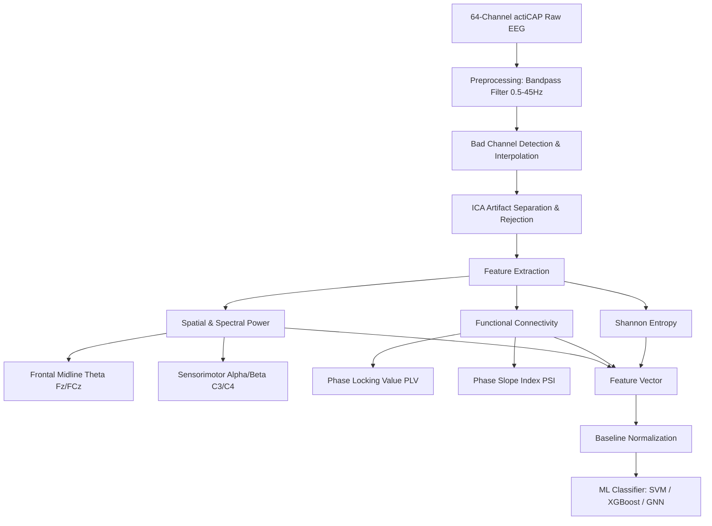

# EEG-Based Flow State Detection: Biomarker & Feature Engineering Plan (64-Channel actiCAP + VR)

This document outlines the technical specifications for an EEG-based machine learning classification algorithm designed for a **64-channel Brain Products actiCAP** system integrated with a **Virtual Reality (VR) headset**. 

---

## 1. Preprocessing Advancements (64-Channel ActiCAP)

High-density (64-channel) active EEG systems provide clean signals but are subject to mechanical and electromagnetic interference (EMI) from the VR headset. 

*   **Filter & ICA Specifications:** 
    *   Zero-phase Butterworth filter (**0.5–45 Hz**).
    *   Infomax ICA to isolate and zero-out eye blinks and facial/neck muscle tension from VR head straps using templates (e.g., *IClabel*).
*   **References:** 
    *   *Knierim et al. (2025)* for filtering and Riemannian Artifact Subspace Reconstruction (rASR) cleaning.
    *   *Rosso et al.* for preprocessing filters and single-subject Independent Component Analysis (ICA) artifact removal.

---

## 2. Spatial & Spectral Biomarkers

With full scalp coverage, we target specific regions of interest (ROIs) to capture spectral power:

### Biomarker A: Frontal Midline Theta ($Fm\theta$)
*   **Target Channels:** Frontal-central midline electrodes (**Fz, FCz, Cz**).
*   **References:** 
    *   *Katahira et al. (2018)* (Identifies increased frontal theta as a marker of sustained attention in flow).
    *   *Knierim et al. (2025)* (Identifies the inverted-U quadratic relationship of theta power and flow).
    *   *Hang et al. (2024)* (Validates prefrontal theta power positive correlations with subjective flow).
*   **Justification:** Frontal midline theta is the primary neurophysiological correlate of focused attention, working memory, and cognitive control, which are the cognitive building blocks of flow. Because it shows a quadratic, inverted-U relationship with flow, it serves as a sensitive thermometer to distinguish flow from both disengaged boredom (low theta) and stressful cognitive overload (excessive theta).

### Biomarker B: Sensorimotor Rhythms (SMR / Alpha & Beta)
*   **Target Channels:** Motor cortex (**C3, C4, CP3, CP4**).
*   **References:** 
    *   *Tan et al. (2024)* (Examines frontocentral upper alpha and beta power increases post-movement in expert musicians).
    *   *Berta et al. (2013)* (Distinguishes flow from boredom and frustration using alpha, low-beta, and mid-beta power).
*   **Justification:** During active task execution, particularly in VR where motor coordination is high, alpha and beta rhythms over the motor cortex represent the automation of movements and the suppression of irrelevant environmental distractions. In highly skilled performers, an increase in these bands post-movement indicates successful motor execution and the "after-glow" of flow-based automation.

### Biomarker C: Inter-Hemispheric Asymmetry (Left vs. Right)
*   **Target Channels:** Frontal pairs (**F3/F4, F7/F8**) and Central-Parietal pairs (**C3/C4, P3/P4**).
*   **References:** 
    *   *Knierim et al. (2025)* (Identifies a novel convex quadratic relationship where beta power asymmetry near zero indicates peak flow).
*   **Justification:** Inter-hemispheric asymmetry tracks motivational direction and emotional state. In flow, having a beta power asymmetry near zero indicates a state of cognitive balance where neither logical-executive nor creative-default processing dominates, representing the cohesive coordination of both cerebral hemispheres during optimal task immersion.

---

## 3. Advanced Features (Enabled by 64 Channels)

### Biomarker D: Functional Connectivity (Network Coherence)
*   **Target Channels:** Frontal (ECN) array (**F3, F4, Fz**) to Parietal (DMN) array (**P3, P4, Pz**).
*   **References:** 
    *   *Tan et al. (2024)* (Utilizes Phase Slope Index (PSI) to show functional connectivity changes and directional information flow originating from frontal areas during flow).
*   **Justification:** Flow is a whole-brain network state characterized by the coordinated coupling of the executive attention network and the default mode network. Measuring functional connectivity (like PLV or directional PSI) allows the ML model to verify that different brain regions are communicating synchronously, which distinguishes genuine flow from isolated local processing.

### Biomarker E: Prefrontal Shannon Entropy
*   **Target Channels:** Prefrontal array (**Fp1, Fp2, AF3, AF4, AF7, AF8**).
*   **References:** 
    *   *Rosso et al.* (Implements Shannon entropy on prefrontal sensors to quantify signal complexity in the flow model).
*   **Justification:** Shannon entropy quantifies the predictability and complexity of raw brain signals over time. Entering flow reduces signal complexity (lower entropy) as the prefrontal cortex shifts from chaotic, analytical thinking to a highly organized and synchronized processing pattern.

---

## 4. VR Integration & Baseline Strategy

*   **VR Noise Check:** Measure baseline electromagnetic interference with the headset powered on.
*   **Resting Baseline:** Record a 2-minute eyes-open baseline inside a neutral VR lobby.
*   **References:** 
    *   *Rosso et al.* (Integrates baseline calibration and validation via questionnaires).
    *   *Knierim et al. (2025)* (Uses eyes-open rest stages to normalize frequency band powers).
*   **Justification:** Normalizing active task EEG features against an individual's resting baseline is required to control for personal physiological baselines and the environmental electrical noise introduced by VR displays, ensuring the classifier detects cognitive shifts rather than static hardware characteristics.
