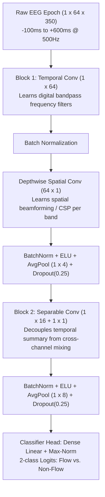

# EEGNet Architecture: Supervisory Summary & Neurophysiological Rationale

**Project:** VR-EEG Flow State Classifier  
**Target Audience:** PhD Supervisory & Neuroengineering Review  
**Reference Paper:** Lawhern et al. (2018), *EEGNet: a compact convolutional neural network for EEG-based brain-computer interfaces*  
**Implementation:** [`src/eegnet.py`](../src/eegnet.py)  

---

## 1. Core Concept & Motivation

* **Tailored for Low-SNR Neuroimaging:** Standard 2D computer-vision CNNs overfit rapidly on multichannel EEG due to parameter explosion and temporal-spatial correlation mixing. EEGNet uses specialized, factorized convolutions that decouple **temporal frequency learning** from **spatial electrode topography**, requiring only **~2,500 trainable parameters**.
* **Direct Raw Microvolt Ingestion:** Eliminates the need for manual feature engineering (e.g., Welch PSD, Hilbert transforms, or phase-locking values), ingesting normalized 4D tensors directly:
  $$\mathbf{X} \in \mathbb{R}^{\text{Batch} \times 1 \times 64 \times 350}$$

---

## 2. Layer-by-Layer Architectural Breakdown

### Block 1 — Temporal & Spatial Filtering (Frequency + Topography)
* **Temporal Convolution ($1 \times 64$ kernel, $F_1 = 8$ filters):**
  * Acts as a learned digital filterbank across time without channel mixing.
  * Captures frequency-specific oscillations (e.g., frontal Theta $4\text{–}8\text{ Hz}$, sensorimotor Alpha/SMR $8\text{–}12\text{ Hz}$, Beta $13\text{–}30\text{ Hz}$) directly from microvolt dynamics.
* **Depthwise Spatial Convolution ($64 \times 1$ kernel, depth multiplier $D = 2$):**
  * Convolves spatially across all 64 scalp electrodes independently for each learned temporal filter.
  * Mathematically equivalent to learning **spatial filters** (analogous to Common Spatial Patterns [CSP] or spatial beamforming) to isolate localized cortical dipole sources.
  * Uses a **Max-Norm constraint ($\le 1.0$)** to prevent filter weight explosion in low-SNR environments.
* **Average Pooling ($1 \times 4$) & Dropout ($p = 0.25$):**
  * Downsamples temporal resolution to build invariance against millisecond-scale phase shifts.

### Block 2 — Separable Convolution (Temporal Summary & Feature Decoupling)
* **Depthwise Temporal ($1 \times 16$) + Pointwise ($1 \times 1$, $F_2 = 16$ filters):**
  * Decoupled architecture first summarizes individual feature maps over an extended temporal window, then mixes representations across feature maps.
  * Drastically reduces model parameters to avoid overfitting on limited trial numbers.
* **ELU Activation & Average Pooling ($1 \times 8$):**
  * Exponential Linear Units preserve negative signal inflections crucial for bi-phasic Event-Related Potentials (ERPs) while preventing dead neurons.

### Classification Head — Calibrated Dense Linear Layer
* **Max-Norm Constrained Linear Layer ($\le 0.25$):**
  * Flattens the low-dimensional latent space into a 2-class output ($P(\text{Flow})$ vs. $P(\text{Non-Flow})$).
  * Trained with **dynamic class re-weighting** ($w_c = \frac{N_{\text{total}}}{2 \cdot N_c}$) and `ReduceLROnPlateau` to counter normal-to-conflict trial imbalance.

---

## 3. Why It Outperforms Legacy Baselines for Closed-Loop VR

1. **Sub-Second Event Locking:**
   * Operates on $700\text{ ms}$ windows centered on the contact event (`box:touched`). This captures the transient ($150\text{–}350\text{ ms}$) **Prediction Error Negativity (PEN/N200)** that was completely diluted by the legacy SVM's wide $2.0\text{s}$ sliding windows.
2. **Phase Topology Preservation:**
   * Unlike legacy feature extractors that collapsed 64 channels into 14 scalar averages, EEGNet preserves cross-channel phase relationships and electrode geography.
3. **Real-Time Latency:**
   * Legacy feature extraction: $\approx 82.1\text{ ms}$ (Welch PSD, Hilbert, PLV).
   * EEGNet forward pass: **$< 2.5\text{ ms}$** (a $\approx 33\times$ latency reduction), comfortably meeting the $< 100\text{ ms}$ frame budget for adaptive VR mini-games.
