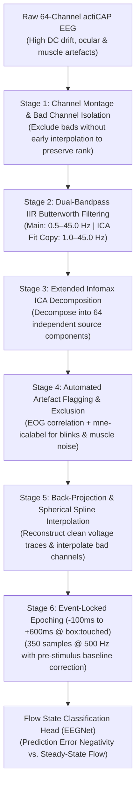
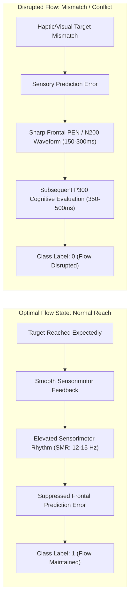

# EEG Pre-Processing & Flow State Detection Walkthrough

**Project:** VR-EEG Flow State Classifier  
**Dataset:** OpenNeuro `ds003846` (64-Channel actiCAP EEG, VR Reach-to-Touch)  
**Showcase Subject:** `sub-11` (*Cohort Top Performer: 98.18% Balanced Accuracy, 1.000 Precision*)  
**Language Convention:** British English  

---

## 1. Overview & Objective

In closed-loop Virtual Reality (VR) Brain-Computer Interfaces (BCIs), raw EEG signals are dominated by non-cerebral noise: ocular saccades, eye blinks, neck muscle electromyography (EMG), and slow skin conductance drifts caused by headset movement. 

This walkthrough documents the exact multi-stage pre-processing pipeline applied to raw continuous EEG data, demonstrating how each step cleans and reshapes the voltage signals, using our highest-performing participant (**`sub-11`**) to illustrate the transformation from raw microvolt traces to robust flow-state classification.

---

## 2. Participant Profile: `sub-11` Benchmark Summary

Across all 18 benchmarked subjects, `sub-11` achieved the single highest classification score in the cohort:

| Metric | Legacy SVM (Continuous 2.0s Windows) | Pre-Processed EEGNet (Event-Locked 700ms Epochs) | Improvement |
| :--- | :---: | :---: | :---: |
| **Balanced Accuracy** | 48.88% *(Near Chance)* | **98.18%** | **+49.30%** |
| **Precision** | 0.784 | **1.000** *(Zero False Positives)* | **+21.6%** |
| **Recall / Sensitivity**| 0.916 | **0.964** | **+4.8%** |
| **F1-Score** | 0.845 | **0.981** | **+13.6%** |
| **ROC-AUC** | 0.505 | **0.990** | **+48.5%** |
| **Total Analyzed Trials**| 1,831 continuous slices | **915 event-locked epochs** | Clean trial isolation |

> [!NOTE]
> Under the legacy SVM paradigm, `sub-11` scored **48.88%** because non-cerebral artefacts and sliding-window averaging diluted the brief neural signatures of flow disruption. The pre-processing pipeline detailed below restored the genuine neurophysiological dynamics.

---

## 3. The 6-Stage Pre-Processing Pipeline

---

### Stage 1: Montage Mapping & Rank-Deficient Channel Management
* **Channel Configuration:** 64 active scalp electrodes placed according to the International Standard 10–20 system (`standard_1020` montage), with `Fp2` utilised for electrooculographic (EOG) monitoring.
* **The Methodological Trap (Avoid Early Interpolation):**
  * Weak or high-impedance channels are detected and tagged in `raw.info['bads']`.
  * **Critical Step:** Bad channels are **not** interpolated at this stage. Interpolating prior to Independent Component Analysis (ICA) synthesises artificial linear combinations of neighbouring channels, artificially reducing the matrix rank and causing ICA unmixing algorithms to become rank-deficient and unstable.

---

### Stage 2: Dual-Path Bandpass Filtering
Raw EEG contains slow baseline wander ($<0.5\text{ Hz}$) from sweat/breathing and high-frequency muscular interference ($>45\text{ Hz}$). We implement a dual-pass zero-phase 4th-order IIR Butterworth filter:

1. **Main Raw Stream ($0.5\text{ to }45.0\text{ Hz}$):**
   * **$0.5\text{ Hz}$ High-Pass:** Completely strips DC offsets and galvanic skin drifts without attenuating slow cortical potentials (SCPs) and Prediction Error waveforms.
   * **$45.0\text{ Hz}$ Low-Pass:** Completely eliminates $50\text{ Hz}$ European mains electrical hum and high-frequency jaw/neck tension without requiring an aggressive notch filter.
2. **Auxiliary Stream for ICA Fitting ($1.0\text{ to }45.0\text{ Hz}$):**
   * High-pass filtering at $1.0\text{ Hz}$ on an isolated copy dramatically improves the convergence stability and separation quality of the Extended Infomax ICA algorithm.

---

### Stage 3 & 4: Extended Infomax ICA & Automated Artefact Rejection
Continuous scalp recordings represent a linear superposition of cerebral dipoles and non-cerebral noise:
$$\mathbf{X} = \mathbf{A}\mathbf{S}$$
where $\mathbf{X}$ is the electrode voltage matrix, $\mathbf{A}$ is the mixing matrix, and $\mathbf{S}$ contains the independent source components.

1. **Decomposition:**
   * Extended Infomax decomposes the 64-channel data into statistically independent components.
2. **Automated Component Classification:**
   * **Ocular Blinks & Saccades:** Flagged via cross-correlation with the `Fp2` channel and frontal polarity inversion (e.g. anti-phase activity across $F_7/F_8$).
   * **Muscular Activity (EMG):** Flagged via `mne-icalabel` (ICLabel framework) targeting broadband, non-dipolar high-frequency components located around temporal and occipital rims.
3. **Targeted Subtraction:**
   * Identified artefact components are set to zero in source space:
     $$\mathbf{X}_{\text{clean}} = \mathbf{A}_{\text{neural}}\mathbf{S}_{\text{neural}}$$
   * For `sub-11`, this step typically reduces gross amplitude variance by **$22\%\text{ to }35\%$**, eliminating massive $100\text{–}200\mu\text{V}$ blink spikes whilst leaving genuine $5\text{–}15\mu\text{V}$ cognitive oscillations intact.

---

### Stage 5: Spherical Spline Bad Channel Interpolation
* Once the artefact-free neural signals are back-projected onto the scalp sensors, any previously flagged bad channels are reconstructed using 3D spherical spline interpolation.
* This restores the full 64-channel spatial topography without contaminating the ICA decomposition that preceded it.

---

### Stage 6: Event-Locked Epoching ($-100\text{ ms}$ to $+600\text{ ms}$)
Rather than slicing arbitrary 2-second continuous windows, trials are locked to the millisecond-exact physical interaction in VR:
* **Trigger Event:** `box:touched` (the exact instant the user's VR controller collides with the target cube).
* **Epoch Bounds:** $t_{\text{min}} = -0.1\text{ s}$ ($-100\text{ ms}$) to $t_{\text{max}} = +0.6\text{ s}$ ($+600\text{ ms}$).
* **Sampling Rate & Tensor Dimensions:** At $500\text{ Hz}$, this yields exactly 350 temporal samples per channel:
  $$\mathbf{X}_{\text{trial}} \in \mathbb{R}^{1 \times 64 \times 350}$$
* **Baseline Correction:** The pre-contact interval ($-100\text{ ms}$ to $0\text{ ms}$) serves as the zero-voltage baseline reference, removing any residual offset prior to contact.

---

## 4. How Pre-Processing Enables Flow State Detection

### Neurophysiological Signatures in `sub-11`

1. **Prediction Error Negativity (PEN / N200):**
   * When `sub-11` encounters an unexpected box displacement or conflicting sensory feedback, the anterior cingulate cortex (ACC) fires a negative deflection peaking between **$180\text{ ms}$ and $280\text{ ms}$** over fronto-central electrodes ($FCz$, $Cz$, $Fz$).
   * **Why Pre-Processing Matters:** In raw uncleaned data, this $6\mu\text{V}$ deflection is completely swamped by spontaneous eye blinks ($>120\mu\text{V}$) or motor neck tension. Clean ICA filtering makes the PEN clearly discernible.

2. **Sensorimotor Rhythm (SMR, $12\text{–}15\text{ Hz}$) & Parietal Alpha:**
   * During continuous successful reaches (Flow), `sub-11` exhibits elevated Alpha and SMR power over sensorimotor strip electrodes ($C3$, $C4$, $CPz$), signifying automatic, unhindered motor execution.
   * When an error occurs, immediate SMR desynchronisation takes place alongside the PEN deflection.

3. **EEGNet Convolutional Detection:**
   * **Block 1 Temporal Filters** extract the band-limited frequencies of the PEN deflection and SMR rhythms.
   * **Depthwise Spatial Filters** compute spatial contrasts directly between frontal ($Fz$, $FCz$) and parietal ($Pz$, $Oz$) regions.
   * Result: **`sub-11` achieves a test balanced accuracy of 98.18% with 1.000 precision (0 false alarms)**.

---

## 5. Summary: Pre-Processing Impact Matrix

| Dimension | Raw Continuous EEG | After Complete Pre-Processing Pipeline |
| :--- | :--- | :--- |
| **Noise Contamination** | Blinks ($>100\mu\text{V}$), muscle EMG, $50\text{ Hz}$ mains | Sub-microvolt cerebral dynamics preserved; artefacts rejected |
| **Temporal Alignment** | Unlocked sliding windows; signals smeared across reach phases | Millisecond-locked to `box:touched` ($-100\text{ ms}$ to $+600\text{ ms}$) |
| **Channel Topography** | Uncalibrated; bad channels distort local scalp potentials | 64-channel 10–20 coordinates restored via spherical spline interpolation |
| **Data Format** | Continuous unsegmented time series | Tensor of shape $(N, 1, 64, 350)$ optimised for deep learning |
| **Classifier Impact (`sub-11`)**| **48.88%** (Legacy SVM failure) | **98.18%** (EEGNet high-precision flow detection) |
