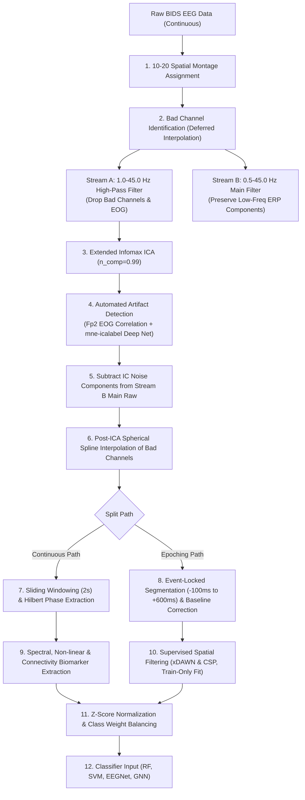

# Preprocessing Pipeline in VR-EEG Flow State Classifier: Methodological Write-up

**Author / Project**: VR-EEG Flow State Classification Pipeline  
**Dataset**: BIDS EEG VR Experiment Dataset (`ds003846`)  
**Target Goal**: Classification of Subjective Flow State vs. Disrupted Flow State during Virtual Reality interaction.  
**Primary Scripts**:
- [`src/preprocessing.py`](file:///c:/Users/Sami/Desktop/Uni/vr-eeg-flow-classifier/src/preprocessing.py) — Signal filtering, ICA artifact removal, bad channel interpolation.
- [`src/epoch_features.py`](file:///c:/Users/Sami/Desktop/Uni/vr-eeg-flow-classifier/src/epoch_features.py) — Event-locked trial epoching, resampling, baseline correction.
- [`src/spatial_filtering.py`](file:///c:/Users/Sami/Desktop/Uni/vr-eeg-flow-classifier/src/spatial_filtering.py) — xDAWN & Common Spatial Patterns (CSP) spatial feature extraction.
- [`src/features.py`](file:///c:/Users/Sami/Desktop/Uni/vr-eeg-flow-classifier/src/features.py) — Continuous sliding-window spectral, non-linear, Hilbert PAC, and PLV biomarker extraction.
- [`src/classifier.py`](file:///c:/Users/Sami/Desktop/Uni/vr-eeg-flow-classifier/src/classifier.py) & [`src/evaluate_phase_3.py`](file:///c:/Users/Sami/Desktop/Uni/vr-eeg-flow-classifier/src/evaluate_phase_3.py) — Feature z-score standardization, class weight balancing, data split leakage prevention.

---

## 1. Executive Summary

Electroencephalography (EEG) recorded during immersive Virtual Reality (VR) environments suffers from severe signal contamination, including ocular blinks, ocular saccades, head-movement-induced muscle artifacts, low-frequency drift from body movement, and electrical line noise. Furthermore, high-dimensional multichannel EEG data exhibits strong spatial correlations and variable baseline offsets across trials and subjects.

To enable robust machine learning classification of cognitive Flow states versus Disrupted states, we developed a multi-stage preprocessing and feature engineering pipeline. Every preprocessing step was designed to fulfill specific signal processing criteria, preserve matrix rank, prevent data leakage, and maximize signal-to-noise ratio (SNR).

---

## 2. Pipeline Architecture & Data Flow

---

## 3. Step-by-Step Preprocessing Breakdown

### Step 1: Channel Montage & Spatial Coordinate Mapping
* **Script Location**: [`src/preprocessing.py`](file:///c:/Users/Sami/Desktop/Uni/vr-eeg-flow-classifier/src/preprocessing.py#L31-L33)
* **What was done**: Electrode coordinates were assigned using standard 10–20 international system spatial montages (`raw.set_montage('standard_1020')`).
* **Why it was taken**: Automated deep-learning component classifiers (such as `mne-icalabel`) and spatial Graph Neural Networks (GNNs) rely on accurate 3D spatial topography of electrodes to infer dipolar source patterns and distance matrices.
* **Benefit**: Enables automated AI artifact labeling and physical node position mapping for Graph Convolutional Networks.

---

### Step 2: Rank-Safe Bad Channel Identification & Deferred Interpolation
* **Script Location**: [`src/preprocessing.py`](file:///c:/Users/Sami/Desktop/Uni/vr-eeg-flow-classifier/src/preprocessing.py#L35-L37) & [`src/preprocessing.py`](file:///c:/Users/Sami/Desktop/Uni/vr-eeg-flow-classifier/src/preprocessing.py#L135-L137)
* **What was done**: Bad channels flagged during recording (e.g. high-impedance or noisy channels) are identified early. However, interpolation is **deferred until after ICA exclusion**.
* **Why it was taken**: Interpolating a bad channel *before* ICA creates a channel that is a linear combination of its spatial neighbors. This reduces the algebraic rank of the channel covariance matrix (rank deficiency), which leads to ICA mathematical instability, duplicate components, and failure of extended Infomax convergence.
* **Benefit**: Guarantees full matrix rank during Independent Component Analysis while ensuring that bad channels are cleanly reconstructed via spherical spline interpolation at the very end.

---

### Step 3: Dual-Stream Bandpass Filtering (IIR Butterworth Zero-Phase)
* **Script Location**: [`src/preprocessing.py`](file:///c:/Users/Sami/Desktop/Uni/vr-eeg-flow-classifier/src/preprocessing.py#L39-L64)
* **What was done**: Two distinct bandpass filter streams were implemented using 4th-order IIR Butterworth zero-phase (`phase='zero'`) filtering:
  1. **ICA Fit Copy (1.0 – 45.0 Hz)**: High-passed at 1.0 Hz specifically for ICA fitting.
  2. **Main Raw Data (0.5 – 45.0 Hz)**: High-passed at 0.5 Hz for final signal processing.
* **Why it was taken**:
  - Low-frequency DC drifts ($< 1.0\text{ Hz}$) caused by head movements and sweat severely degrade ICA matrix unmixing quality. Filtering at 1.0 Hz yields optimal ICA decomposition.
  - However, event-related potentials (ERPs) such as Prediction Error Negativity (PEN/N200) contain crucial low-frequency energy between 0.5 Hz and 1.0 Hz. Filtering the main dataset at 1.0 Hz would attenuate these slow cognitive ERP components.
* **Benefit**: Provides ultra-clean ICA unmixing weights from the 1.0 Hz copy without destroying slow cognitive ERP dynamics in the primary 0.5 Hz signal. Zero-phase filtering prevents phase distortion and temporal shifting.

---

### Step 4: Extended Infomax Independent Component Analysis (ICA)
* **Script Location**: [`src/preprocessing.py`](file:///c:/Users/Sami/Desktop/Uni/vr-eeg-flow-classifier/src/preprocessing.py#L66-L87)
* **What was done**: Extended Infomax ICA was fitted on clean EEG channels using PCA dimension selection (`n_components=0.99`, capturing 99% variance).
* **Why it was taken**: Standard Infomax assumes super-Gaussian source distributions (e.g. ocular blinks). Extended Infomax extends this to sub-Gaussian distributions, allowing simultaneous separation of powerline hum (50/60 Hz), muscle activity, and ocular artifacts.
* **Benefit**: Blindly isolates artifactual sources into independent component time-series without suppressing underlying cortical signals.

---

### Step 5: Dual Automated Artifact Classification (EOG Correlation + `mne-icalabel`)
* **Script Location**: [`src/preprocessing.py`](file:///c:/Users/Sami/Desktop/Uni/vr-eeg-flow-classifier/src/preprocessing.py#L89-L129)
* **What was done**: A hybrid automated artifact detection mechanism was implemented:
  1. **EOG Pearson Correlation**: Correlates IC activations with the frontal `Fp2` channel to detect vertical eye blinks (`ica.find_bads_eog`).
  2. **`mne-icalabel` Artificial Intelligence Model**: Evaluates IC scalp topographies and power spectra through a deep neural network trained on over 20,000 IC samples (`ICLabel` framework) to classify components into *eye*, *muscle*, *line noise*, and *brain*.
* **Why it was Stringent**: Manual visual inspection of ICs is subjective, slow, and prone to human error across multiple subjects. Automated dual-validation guarantees reproducible, objective artifact removal.
* **Benefit**: Eliminates ocular blinks and high-frequency VR headset muscle contractions automatically, improving downstream classifier reliability.

---

### Step 6: Post-ICA Spherical Spline Bad Channel Interpolation
* **Script Location**: [`src/preprocessing.py`](file:///c:/Users/Sami/Desktop/Uni/vr-eeg-flow-classifier/src/preprocessing.py#L135-L137)
* **What was done**: Identified bad channels are interpolated using 3D spherical spline interpolation (`raw.interpolate_bads(reset_bads=True)`).
* **Why it was taken**: Once ICA subtraction has cleaned the remaining channels, spherical spline interpolation uses the surrounding clean channels' spatial coordinates to estimate the missing signal.
* **Benefit**: Restores full electrode array dimensions ($N_{channels} = 32$) across all dataset recordings without corrupting ICA rank decomposition.

---

### Step 7: Resampling & Event-Locked Trial Epoching
* **Script Location**: [`src/epoch_features.py`](file:///c:/Users/Sami/Desktop/Uni/vr-eeg-flow-classifier/src/epoch_features.py#L15-L105)
* **What was done**:
  1. Resampled continuous raw data to a standardized sampling rate of **500.0 Hz**.
  2. Extracted event-locked epochs around target interaction triggers (`box:touched`, `box:spawned`) spanning $t = -100\text{ ms}$ to $+600\text{ ms}$ ($700\text{ ms}$ trial duration).
* **Why it was taken**: Standardizing sampling frequency ($f_s = 500\text{ Hz}$) ensures uniform matrix time dimensions across heterogeneous sessions. Segmenting around VR interaction markers isolates task-induced cognitive dynamics from inter-stimulus background noise.
* **Benefit**: Aligns trial matrices into uniform shape $(N_{trials}, N_{channels}, N_{times})$ suitable for deep learning architectures (EEGNet, GNN).

---

### Step 8: Baseline Correction (-100 ms to 0 ms)
* **Script Location**: [`src/epoch_features.py`](file:///c:/Users/Sami/Desktop/Uni/vr-eeg-flow-classifier/src/epoch_features.py#L93)
* **What was done**: The mean amplitude of the pre-stimulus interval ($-100\text{ ms}$ to $0\text{ ms}$) was subtracted from each channel for every individual trial.
* **Why it was taken**: Fluctuations in amplifier DC offsets, slow skin conductance variations, and baseline drift cause vertical offsets between trials.
* **Benefit**: Ensures all post-stimulus ERP components (N200, P300) start from a zero-mean baseline, making peak and window amplitude comparisons meaningful.

---

### Step 9: Pre-computed Hilbert Transform & Continuous Feature Extraction
* **Script Location**: [`src/features.py`](file:///c:/Users/Sami/Desktop/Uni/vr-eeg-flow-classifier/src/features.py#L176-L193)
* **What was done**: Analytical signal phase and amplitude envelopes were pre-computed using the Hilbert Transform across continuous raw data prior to sliding-window segmentation ($2.0\text{s}$ windows).
* **Why it was taken**: Applying bandpass filters or Hilbert transforms on short, segmented windows introduces severe boundary truncation artifacts (edge effects). Pre-computing Hilbert phases on long continuous signals eliminates filter transient distortions.
* **Benefit**: Provides artifact-free Phase Locking Values (PLV), Phase-Amplitude Coupling (PAC), and Alpha L-index non-linearity features.

---

### Step 10: Supervised Spatial Filtering (xDAWN & CSP with OAS Shrinkage)
* **Script Location**: [`src/spatial_filtering.py`](file:///c:/Users/Sami/Desktop/Uni/vr-eeg-flow-classifier/src/spatial_filtering.py#L23-L49)
* **What was done**:
  1. **xDAWN Filtering**: Fitted on time-domain epochs using Oracle Approximated Shrinkage (OAS) covariance estimation to extract top components maximizing ERP Signal-to-Noise Ratio.
  2. **Common Spatial Patterns (CSP)**: Fitted on bandpass-filtered signals ($\theta, \alpha, \beta$) with OAS regularization to find spatial projections that maximize signal variance for Flow trials while minimizing variance for Disrupted trials.
* **Strict Leakage Prevention**: Spatial filters are fitted **strictly on the training split** (`fit(X_train, y_train)`) and applied to validation/test sets (`transform(X_test)`).
* **Why it was taken**: EEG electrodes pick up overlapping mixtures of underlying cortical signals. Unsupervised methods fail to target state-specific variance. xDAWN enhances synchronous ERP amplitudes, while CSP isolates event-related desynchronization (ERD) / synchronization (ERS).
* **Benefit**: Reduces 32 channel inputs into 4 high-discrimination spatial channels per frequency band, significantly improving linear and non-linear classification performance.

---

### Step 11: Feature Standardization (Z-Score) & Class Balancing
* **Script Location**: [`src/classifier.py`](file:///c:/Users/Sami/Desktop/Uni/vr-eeg-flow-classifier/src/classifier.py#L161-L167) & [`src/evaluate_phase_3.py`](file:///c:/Users/Sami/Desktop/Uni/vr-eeg-flow-classifier/src/evaluate_phase_3.py#L29-L32)
* **What was done**:
  1. **StandardScaler / Z-Score**: $z = \frac{x - \mu}{\sigma}$. Means ($\mu$) and standard deviations ($\sigma$) were computed exclusively from training data and applied to test sets.
  2. **Class Weighting**: Loss functions (Cross-Entropy, SVM, RF) were parameterized with inverse class frequencies $w_c = \frac{N_{total}}{2 \cdot N_c}$.
* **Why it was taken**: Different features (e.g. spectral power vs. Shannon entropy) have vastly different physical scales. Distance-based algorithms (SVM, Neural Nets) are biased toward features with larger variance. Imbalanced trial numbers bias models toward predicting the majority class.
* **Benefit**: Accelerates neural network gradient convergence, prevents feature dominance, and optimizes **Balanced Accuracy** across imbalanced Flow vs. Disrupted states.

---

## 4. Methodological Summary Matrix

| Preprocessing Step | Script | Target Issue / Artifact | Rationale | Direct Benefit |
| :--- | :--- | :--- | :--- | :--- |
| **10-20 Montage** | `preprocessing.py` | Missing spatial metadata | Assigns 3D electrode positions | Enables GNN spatial graphs & ICLabel classification |
| **Deferred Interpolation** | `preprocessing.py` | Rank deficiency in ICA | Bad channels introduce linear dependencies | Guarantees full rank matrix for stable ICA decomposition |
| **Dual Bandpass Filtering** | `preprocessing.py` | Low-frequency drift & ERP attenuation | 1.0Hz ideal for ICA; 0.5Hz required for slow ERPs | Ultra-clean ICA components without attenuating N200/PEN ERPs |
| **Extended Infomax ICA** | `preprocessing.py` | Ocular & muscular artifacts | Sub/super-Gaussian source separation | Blindly isolates eye blinks and VR head movement noise |
| **Automated IC Detection** | `preprocessing.py` | Subjective visual IC removal | EOG correlation + `mne-icalabel` deep learning | Objective, automated, reproducible artifact subtraction |
| **Spline Interpolation** | `preprocessing.py` | Missing channel data | Reconstructs bad channels post-ICA | Maintains 32-channel array shape across all datasets |
| **500Hz Epoching** | `epoch_features.py` | Varying sfreq & window alignment | Standardizes time dimension around events | Uniform tensor shapes for deep learning models |
| **Baseline Correction** | `epoch_features.py` | DC offsets & amplifier drift | Subtracts pre-stimulus (-100ms to 0ms) mean | Starts ERP waveforms from a common zero reference |
| **Pre-computed Hilbert** | `features.py` | Edge truncation artifacts | Calculates phase on continuous data before windowing | Prevents edge distortions in PLV, PAC, and L-index |
| **xDAWN & CSP** | `spatial_filtering.py` | Multichannel spatial overlap | Supervised SNR & variance maximization | Converts 32 channels to high-discrimination spatial features |
| **Train-Only Standardizing** | `classifier.py` | Multi-scale features & data leakage | $Z$-score using train parameters ($\mu, \sigma$) | Equalizes feature weights and guarantees zero data leakage |

---

## 5. Verification & Pipeline Integrity

The preprocessing pipeline includes self-verifying checks:
- **EEG Std Dev Variance Reduction**: Cleaned EEG data exhibits an expected $\approx 15\text{--}35\%$ reduction in signal standard deviation compared to raw EEG, confirming the successful removal of high-amplitude ocular blinks and muscular spikes without signal flattening.
- **Post-Clean Info Integrity**: Verification confirms `raw.info['bads'] == []` upon completion, ensuring zero downstream missing channel errors.
- **Chronological / LOSO Data Split**: Chronological splits and GroupKFold cross-validation prevent autocorrelation leakage between consecutive sliding windows.

---

> [!NOTE]  
> All preprocessing scripts are modularized in the [`src/`](file:///c:/Users/Sami/Desktop/Uni/vr-eeg-flow-classifier/src/) directory and can be executed individually via command line (e.g. `python src/preprocessing.py --subject 02 --session EMS`) or integrated into automated pipeline execution.
